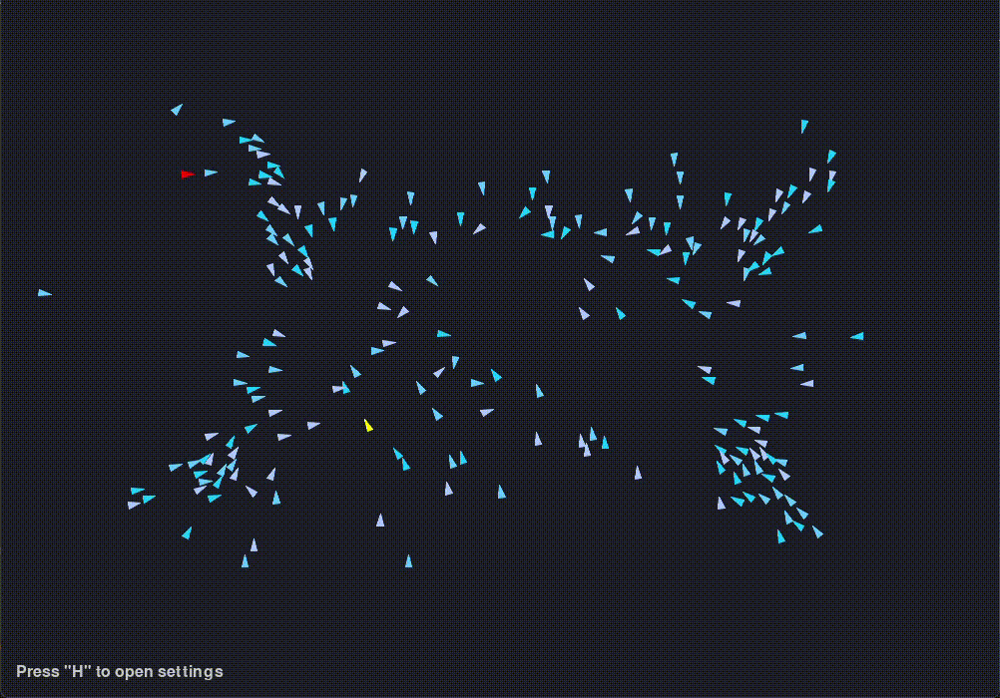
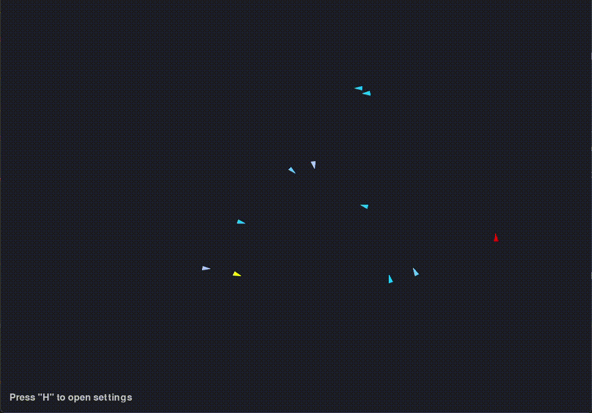
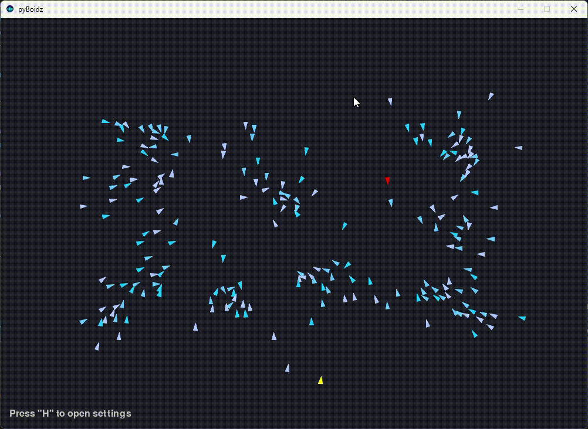
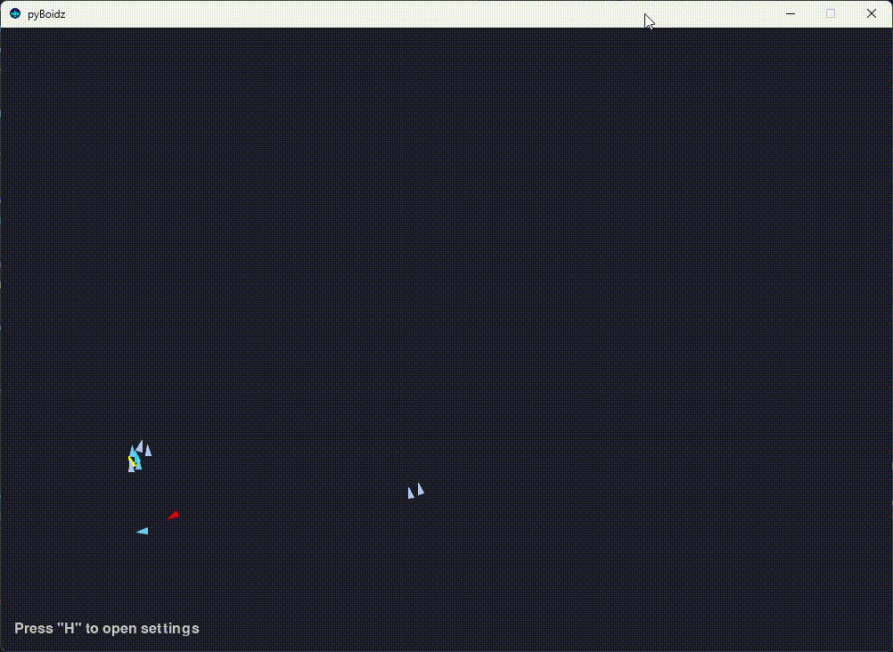

## pyBoidz- Fuzzy approach to Boids Simulation

*Authors: Ricardo Pereira & António Raimundo*

## 🇵🇹

Código-base para a Unidade Curricular (UC) de Inteligênca Artificial do Iscte-Sintra.



### Download do projeto
Para fazer o _download_ do projeto, é necessário seguir as instruções presentes na documentação do código-base.

### Configuração inicial
Os seguintes requisitos são necessários:
1. Ter a versão Python 3.13 ou superior instalada.
2. Criar um ambiente virtual específico para este projeto. Para tal, executem algumas operações:
   1. Atualizar a versão do Python Package Manager (pip): ``pip install --upgrade pip``;
   2. Criar o ambiente virtual (**recomendado**): ``conda create -n NOME_ESCOLHIDO python=3.13``;
   3. Configurar interpretador no VS Code ou PyCharm.

### Comandos iniciais
Para garantir que o projeto base inicia sem problemas, o projeto deve ser importado, e no terminal (garantir que estão localizados na **pasta principal - pyBoidz**)
executem os seguintes comandos:
1. ``pip install -r requirements.txt``
2. ``python -m pip install -e .``

### Comandos de Sistema
Ao correr a simulação existem três eventos que podem ser utilizados durante a execução da simulação.

#### Pressionar a Tecla "H" (Menu de Opções)
Ao pressionar a tecla "H", é apresentado um menu com as seguintes opções de configuração e informação:
1. Escolher o Ficheiro de Configuração: Permite carregar um ficheiro de configuração externo. Este ficheiro deve estar no formato ```.json```.
2. Ativar Fuzzy Logic: O sistema de controlo é ativado, e os comportamentos dos boids e do predador passam a ser totalmente decididos por este sistema.

É também apresentada uma legenda que estabelece a correspondência entre as cores apresentadas no ecrã e as entidades simuladas (boids, predador, etc.).



#### Pressionar a Tecla "P" (Pausa)
Pressionar a tecla "P" suspende a execução da simulação (pausa). Ao pressionar novamente, a simulação retoma.



#### Clicar num Boid/Predador
Ao clicar com o rato numa entidade (boid ou predador), esta fica destacada a verde.

Este destaque é essencial, pois está diretamente ligado à apresentação dos gráficos de output do sistema Fuzzy, permitindo a visualização em tempo real das variáveis de decisão dessa entidade específica.



### Ficheiro `src/fuzzy.py`:
Para garantir a funcionalidade da Fuzzy Logic, é necessário implementar duas classes dentro do ficheiro ```src/fuzzy.py```:

### Boids

```python
class FuzzySystemBoid:
    def __init__(self, config):
        self.config = config

        # ==== Setup Variables ====
        self.__setup_variables()
        # ==== Setup Membership Functions ====
        self.__setup_membership_functions()
        # ==== Setup Rules ====
        self.__setup_rules()
        # ==== Setup Inference System ====
        self.__setup_inference_system()

    def __setup_variables(self):
        pass

    def __setup_membership_functions(self):
        pass

    def __setup_rules(self):
        pass

    def __setup_inference_system(self):
        # ==== Inference System ====

        rules = []

        self.boidz_controller = ctrl.ControlSystem(rules)
        self.boidz_sys = ctrl.ControlSystemSimulation(self.boidz_controller)

    def get_system(self):
        return self.boidz_sys

    def calculate_fuzzy(self, current_entity, boids: list, predators: list):
        pass

    def compute(self):
        return pygame.Vector2(0, 0)

    def get_output_variables(self) -> list[str]:
        """
        Returns a list of all defined output variable names (Consequent labels).
        """
        if not hasattr(self, 'boidz_controller'):
            return []

        return [consequent.label for consequent in self.boidz_controller.consequents]

    def get_input_variables(self) -> list[str]:
        """
        Returns a list of all defined input variable names (Antecedent labels).
        """

        if not hasattr(self, 'boidz_controller'):
            return []

        return [antecedent.label for antecedent in self.boidz_controller.antecedents]
```

#### Predadores
```python
class FuzzySystemPredator:
    def __init__(self, config):
        self.config = config

        # ==== Setup Variables ====
        self.__setup_variables()
        # ==== Setup Membership Functions ====
        self.__setup_membership_functions()
        # ==== Setup Rules ====
        self.__setup_rules()
        # ==== Setup Inference System ====
        self.__setup_inference_system()

    def __setup_variables(self):
        pass

    def __setup_membership_functions(self):
        pass

    def __setup_rules(self):
        pass

    def __setup_inference_system(self):
        # ==== Inference System ====
        rules = []
        self.boidz_controller = ctrl.ControlSystem(rules)
        self.boidz_sys = ctrl.ControlSystemSimulation(self.boidz_controller)

    def get_system(self):
        return self.boidz_sys

    def calculate_fuzzy(self, current_entity, boids: list):
        pass

    def compute(self, current_entity):
        return pygame.Vector2(0, 0)

    def get_output_variables(self) -> list[str]:
        """
        Returns a list of all defined output variable names (Consequent labels).
        """
        if not hasattr(self, 'boidz_controller'):
            return []

        return [consequent.label for consequent in self.boidz_controller.consequents]

    def get_input_variables(self) -> list[str]:
        """
        Returns a list of all defined input variable names (Antecedent labels).
        """

        if not hasattr(self, 'boidz_controller'):
            return []

        return [antecedent.label for antecedent in self.boidz_controller.antecedents]
```

## pyBoidz - Fuzzy Approach to Boids Simulation

*Authors: Ricardo Pereira & António Raimundo*

## 🇬🇧

Base code for the **Artificial Intelligence** course unit at Iscte-Sintra.


---

### Project Download
To **download** the project, please follow the instructions provided in the base code documentation.

### Initial Setup
The following requirements are necessary:
1. Have **Python version 3.13 or higher** installed.
2. Create a specific virtual environment for this project. To do this, run the following operations:
   1. Update the Python Package Manager (pip): `pip install --upgrade pip`
   2. Create the virtual environment (**recommended**): `conda create -n CHOSEN_NAME python=3.13`
   3. Configure the interpreter in VS Code or PyCharm.

### Initial Commands
To ensure the base project starts without issues, the project must be imported. In the terminal (ensure you are located in the **main folder - pyBoidz**), execute the following commands:
1. `pip install -r requirements.txt`
2. `python -m pip install -e .`

---

## 🛠️ System Commands

When running the simulation, there are three main events that can be used for interaction:

### Pressing the "**H**" Key (Options Menu)
Upon pressing the "**H**" key, a menu with the following configuration and information options is displayed:
1. **Choose Configuration File:** Allows loading an external configuration file. **This file must be in `.json` format.**
2. **Activate Fuzzy Logic:** The control system is activated, and the behaviors of the *boids* and the predator will be **fully decided by this system**.

A **legend** is also displayed, which establishes the correspondence between the colors shown on the screen and the simulated entities (*boids*, predator, etc.).


### Pressing the "**P**" Key (Pause)
Pressing the "**P**" key **suspends the execution of the simulation (pause)**. Pressing it again resumes the simulation.


### Clicking on a Boid/Predator
By **clicking** on an entity (*boid* or predator) with the mouse, it becomes **highlighted in green**.

This highlight is essential as it is directly linked to the presentation of the **output plots of the Fuzzy system**, allowing the real-time visualization of the decision variables for that specific entity.


---

## ⚙️ File `src/fuzzy.py`: Implementation

To ensure the functionality of the **Fuzzy Logic**, **two classes** must be implemented inside the file `src/fuzzy.py`:

### Boids

```python
class FuzzySystemBoid:
    def __init__(self, config):
        self.config = config

        # ==== Setup Variables ====
        self.__setup_variables()
        # ==== Setup Membership Functions ====
        self.__setup_membership_functions()
        # ==== Setup Rules ====
        self.__setup_rules()
        # ==== Setup Inference System ====
        self.__setup_inference_system()

    def __setup_variables(self):
        pass

    def __setup_membership_functions(self):
        pass

    def __setup_rules(self):
        pass

    def __setup_inference_system(self):
        # ==== Inference System ====

        rules = []

        self.boidz_controller = ctrl.ControlSystem(rules)
        self.boidz_sys = ctrl.ControlSystemSimulation(self.boidz_controller)

    def get_system(self):
        return self.boidz_sys

    def calculate_fuzzy(self, current_entity, boids: list, predators: list):
        pass

    def compute(self):
        return pygame.Vector2(0, 0)

    def get_output_variables(self) -> list[str]:
        """
        Returns a list of all defined output variable names (Consequent labels).
        """
        if not hasattr(self, 'boidz_controller'):
            return []

        return [consequent.label for consequent in self.boidz_controller.consequents]

    def get_input_variables(self) -> list[str]:
        """
        Returns a list of all defined input variable names (Antecedent labels).
        """

        if not hasattr(self, 'boidz_controller'):
            return []

        return [antecedent.label for antecedent in self.boidz_controller.antecedents]
```

### Predators
```python
class FuzzySystemPredator:
    def __init__(self, config):
        self.config = config

        # ==== Setup Variables ====
        self.__setup_variables()
        # ==== Setup Membership Functions ====
        self.__setup_membership_functions()
        # ==== Setup Rules ====
        self.__setup_rules()
        # ==== Setup Inference System ====
        self.__setup_inference_system()

    def __setup_variables(self):
        pass

    def __setup_membership_functions(self):
        pass

    def __setup_rules(self):
        pass

    def __setup_inference_system(self):
        # ==== Inference System ====
        rules = []
        self.boidz_controller = ctrl.ControlSystem(rules)
        self.boidz_sys = ctrl.ControlSystemSimulation(self.boidz_controller)

    def get_system(self):
        return self.boidz_sys

    def calculate_fuzzy(self, current_entity, boids: list):
        pass

    def compute(self, current_entity):
        return pygame.Vector2(0, 0)

    def get_output_variables(self) -> list[str]:
        """
        Returns a list of all defined output variable names (Consequent labels).
        """
        if not hasattr(self, 'boidz_controller'):
            return []

        return [consequent.label for consequent in self.boidz_controller.consequents]

    def get_input_variables(self) -> list[str]:
        """
        Returns a list of all defined input variable names (Antecedent labels).
        """

        if not hasattr(self, 'boidz_controller'):
            return []

        return [antecedent.label for antecedent in self.boidz_controller.antecedents]
```

